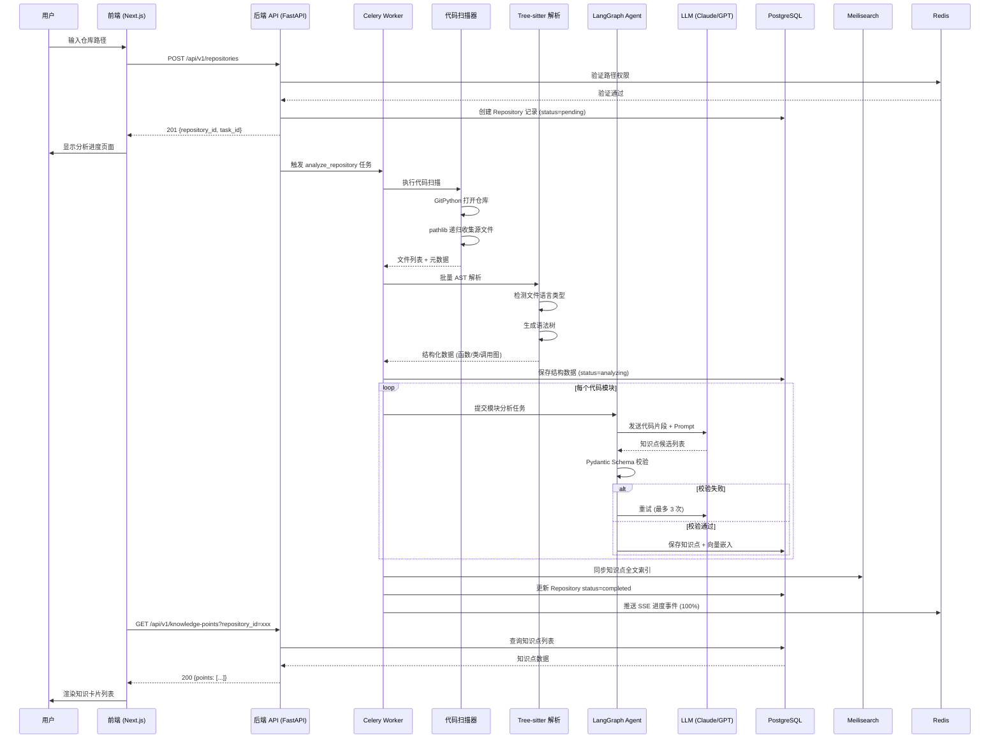
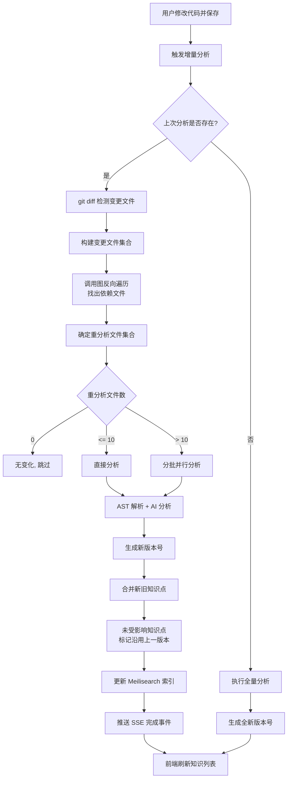
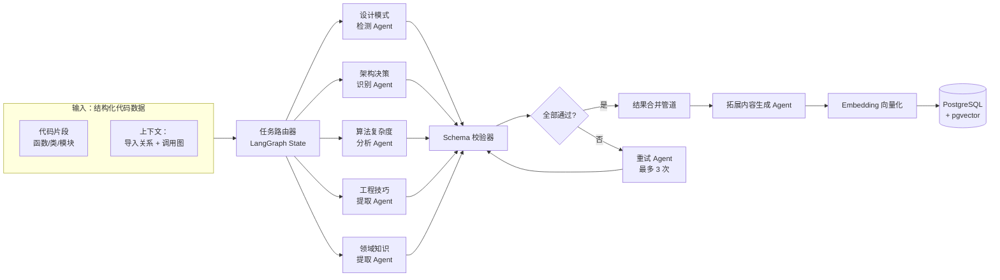
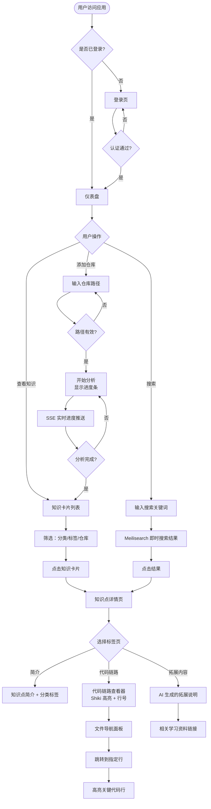
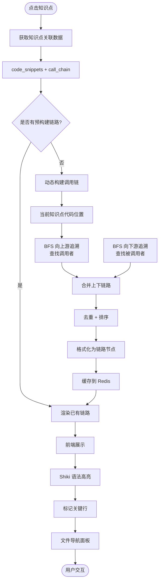
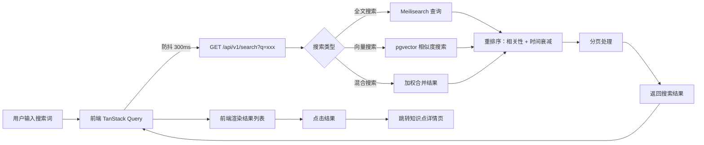
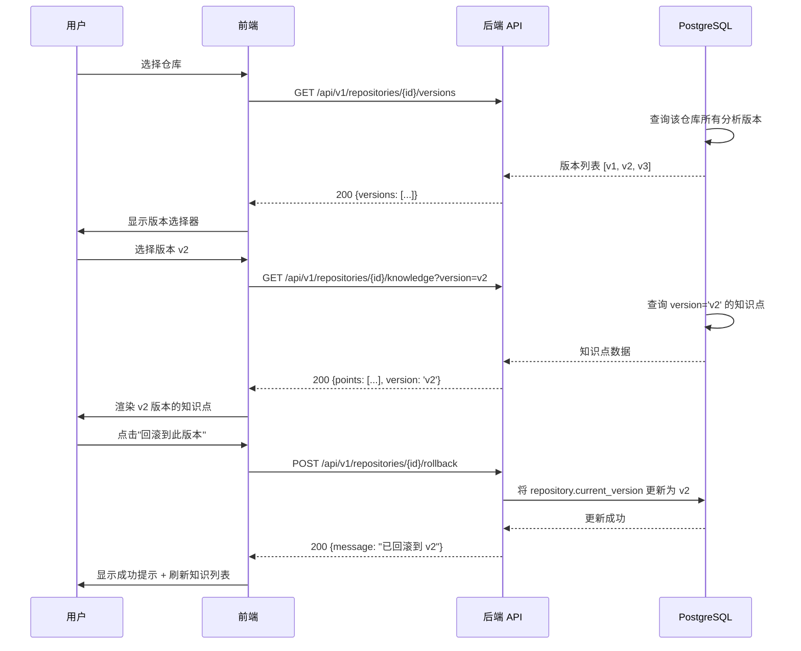
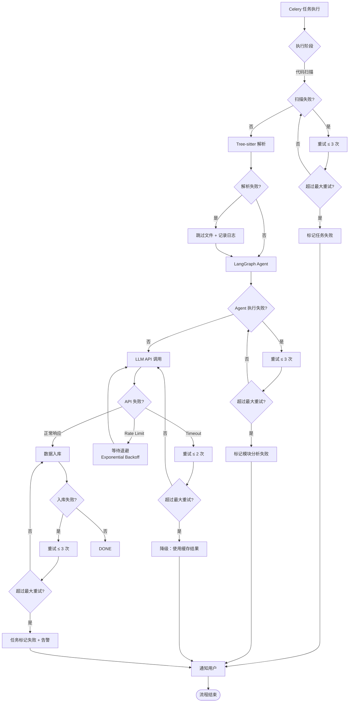
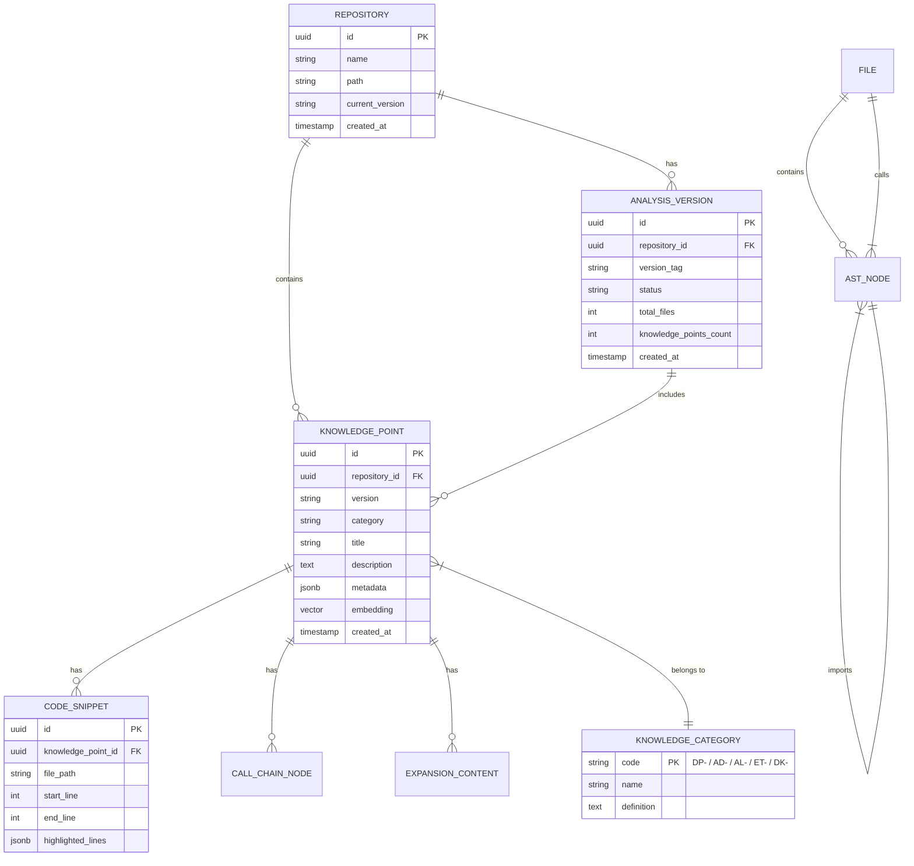

# CodeInsight AI — 业务逻辑流程图

> 本文档描述 CodeInsight AI 系统的核心业务流程，使用 Mermaid 图表呈现。

---

## 目录

1. [仓库添加与分析全流程](#一仓库添加与分析全流程)
2. [增量分析流程](#二增量分析流程)
3. [知识点提取多 Agent 协作流程](#三点知识点提取多-agent-协作流程)
4. [前端用户操作流程](#四前端用户操作流程)
5. [代码链路构建流程](#五代码链路构建流程)
6. [搜索流程](#六搜索流程)
7. [版本管理与回滚流程](#七版本管理与回滚流程)
8. [错误处理与重试流程](#八错误处理与重试流程)

---

## 一、仓库添加与分析全流程



---

## 二、增量分析流程



**依赖传播算法伪代码：**

```python
def find_dependent_files(changed_files: set[str], call_graph: CallGraph) -> set[str]:
    """
    找出所有受变更文件影响的文件。
    策略：变更文件的所有调用方 + 被调用方。
    """
    affected = set(changed_files)
    queue = deque(changed_files)
    
    while queue:
        current = queue.popleft()
        # 上游依赖：谁调用了 current
        callers = call_graph.get_callers(current)
        # 下游依赖：current 调用了谁
        callees = call_graph.get_callees(current)
        
        for dep in callers | callees:
            if dep not in affected:
                affected.add(dep)
                queue.append(dep)
    
    return affected
```

---

## 三、知识点提取多 Agent 协作流程



**各 Agent Prompt 结构模板：**

```
System Prompt:
你是 CodeInsight AI 的{AGENT_NAME}。你的任务是分析代码并识别{TARGET_PATTERN}。

分析规则：
1. {RULE_1}
2. {RULE_2}
3. {RULE_3}

输出格式（严格遵守 JSON Schema）：
{PYDANTIC_SCHEMA}

Few-shot 示例：
示例 1: {EXAMPLE_1}
示例 2: {EXAMPLE_2}
```

---

## 四、前端用户操作流程



---

## 五、代码链路构建流程



**调用链 BFS 算法：**

```python
def build_call_chain(
    start_node: ASTNode,
    call_graph: CallGraph,
    direction: str = "both",  # "upstream" | "downstream" | "both"
    max_depth: int = 5
) -> list[CallChainNode]:
    """
    从起始节点出发，BFS 遍历调用图构建完整链路。
    """
    chain = []
    visited = set()
    queue = deque([(start_node, 0)])
    
    while queue:
        node, depth = queue.popleft()
        if node.id in visited or depth > max_depth:
            continue
        visited.add(node.id)
        
        chain.append(CallChainNode(
            node_id=node.id,
            node_type=node.type,
            file=node.file,
            lines=node.lines,
            signature=node.signature
        ))
        
        if direction in ("upstream", "both"):
            for caller in call_graph.get_callers(node):
                queue.append((caller, depth + 1))
        
        if direction in ("downstream", "both"):
            for callee in call_graph.get_callees(node):
                queue.append((callee, depth + 1))
    
    return sorted_by_execution_order(chain)
```

---

## 六、搜索流程



**搜索权重配置：**

```yaml
search:
  meilisearch:
    attributes_to_search_on: [title, description, tags]
    limit: 20
    offset: 0
  
  vector_search:
    embedding_model: text-embedding-3-small
    top_k: 10
    similarity_threshold: 0.75
  
  hybrid:
    meilisearch_weight: 0.6
    vector_weight: 0.4
    rerank_model: cross-encoder-ms-marco-MiniLM-L-6-v2
```

---

## 七、版本管理与回滚流程



---

## 八、错误处理与重试流程



**错误码定义：**

| 错误码 | HTTP Status | 说明 | 处理建议 |
|--------|------------|------|----------|
| `REPO_NOT_FOUND` | 404 | 仓库不存在 | 检查 repository_id |
| `REPO_PATH_INVALID` | 400 | 仓库路径无效 | 验证路径权限 |
| `TASK_NOT_FOUND` | 404 | 分析任务不存在 | 检查 task_id |
| `TASK_ALREADY_RUNNING` | 409 | 分析任务正在运行 | 等待或取消已有任务 |
| `TASK_FAILED` | 422 | 分析任务失败 | 查看 error_message |
| `KNOWLEDGE_NOT_FOUND` | 404 | 知识点不存在 | 检查 knowledge_point_id |
| `VERSION_NOT_FOUND` | 404 | 版本号不存在 | 检查版本号是否正确 |
| `SEARCH_ERROR` | 500 | 搜索服务异常 | 联系管理员 |
| `LLM_RATE_LIMIT` | 429 | LLM API 限流 | 自动退避重试 |
| `LLM_QUOTA_EXCEEDED` | 402 | LLM API 配额用尽 | 升级套餐或使用本地模型 |

---

## 附录：数据模型关系图


