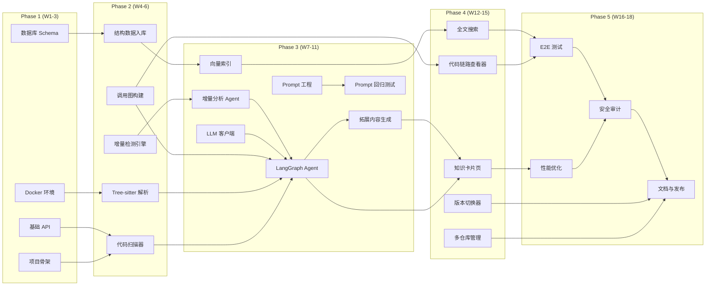

# CodeInsight AI — 开发计划书（优化版）

> **AI 驱动的代码知识提取与可视化分析平台**

| 元信息      | 值                           |
| -------- | --------------------------- |
| **版本**   | v1.1-optimized              |
| **日期**   | 2026-07-07                  |
| **周期**   | 约 18 周（原 16 周，Phase 3/5 延长） |
| **团队规模** | 3-5 人                       |
| **状态**   | Draft                       |

***

## 目录

1. [项目概述与目标](#一项目概述与目标)
2. [系统架构设计](#二系统架构设计)
3. [技术选型明细](#三技术选型明细)
4. [里程碑与路线图](#四里程碑与路线图)
5. [各阶段任务分解](#五各阶段任务分解)
6. [核心模块依赖关系](#六核心模块依赖关系)
7. [风险评估与应对](#七风险评估与应对)
8. [团队配置与分工](#八团队配置与分工)
9. [质量保障策略](#九质量保障策略)
10. [数据安全与隐私](#十数据安全与隐私)
11. [成本估算模型](#十一成本估算模型)
12. [知识库版本管理](#十二知识库版本管理)
13. [参考项目与资料](#十三参考项目与资料)

***

## 一、项目概述与目标

### 1.1 项目背景

开发者在学习开源项目或接手遗留代码时，经常面临一个核心困境：代码仓库里蕴藏了大量有价值的设计思路、技术实现、架构决策，但它们散落在成百上千个文件中，阅读和理解成本极高。现有工具如 Swimm 偏向文档管理，Greptile 偏向代码审查，**没有一个工具能够从代码中自动提取知识点，并以前端可交互的方式完整展示**。

### 1.2 产品定义

**CodeInsight AI** 是一个前后端分离 + AI 驱动的全栈项目。用户指定本地代码仓库目录，系统自动扫描、解析代码结构，调用大语言模型进行语义分析，提取出该项目中所有有价值的技术知识点（设计模式、架构方案、算法实现、工程技巧等），在前端以知识卡片形式展示，点击即可查看该知识点在项目中的**完整代码实现链路**以及**AI 生成的拓展内容**。

### 1.3 核心功能

- **代码仓库扫描**：支持指定目录，自动识别 Git 仓库，递归遍历所有源代码文件
- **AST 结构解析**：通过 Tree-sitter 对 40+ 编程语言进行增量语法树解析，提取函数、类、模块、调用关系
- **AI 知识点提取**：LLM 分析代码结构和语义，识别设计模式、架构决策、算法、工程技巧等知识点
- **知识卡片展示**：前端以卡片列表形式展示，每张卡片附带标题、简介、技术分类标签、关联文件数
- **完整代码链路**：点击知识点可查看从入口到出口的完整代码调用链，高亮关键行
- **拓展内容**：AI 为每个知识点生成拓展说明，包括原理分析、适用场景、最佳实践、相关学习资料
- **全文搜索**：支持按技术标签、文件名、代码片段等维度快速检索
- **多仓库管理**：支持同时管理多个代码仓库的知识库
- **增量分析**：代码变更时只重新分析受影响的部分，大幅提升后续分析速度

### 1.4 知识点分类标准（新增）

为确保 LLM 提取的一致性和可评估性，定义以下五类知识点及其判断标准：

| 类别       | 标识前缀  | 定义                  | 判断标准                           | 示例                                                   |
| -------- | ----- | ------------------- | ------------------------------ | ---------------------------------------------------- |
| **设计模式** | `DP-` | 可复用的软件设计解决方案        | 代码中体现 GoF 23 种模式之一，或有明显的模式结构特征 | Factory, Observer, Strategy, Singleton               |
| **架构决策** | `AD-` | 影响系统整体结构的重大技术选择     | 涉及模块划分、技术选型、通信机制、分层设计          | MVC, CQRS, Event-Driven, Microservices               |
| **算法实现** | `AL-` | 具有特定时间/空间复杂度优化的代码实现 | 实现了经典算法或自定义高效算法                | QuickSort, Dijkstra, LRU Cache                       |
| **工程技巧** | `ET-` | 提升代码质量、可维护性或开发效率的实践 | 包含异常处理、日志、配置管理、测试模式等           | Retry Pattern, Circuit Breaker, Dependency Injection |
| **领域知识** | `DK-` | 业务领域特有的核心逻辑和规则      | 体现特定行业/领域的业务规则和计算逻辑            | 支付路由、风控评分、推荐排序                                       |

### 1.5 代码链路构建逻辑（新增）

代码链路是指从"入口点"到"出口点"的完整调用链，构建流程如下：

```
1. Tree-sitter 解析 → 构建函数/方法/类的 AST 节点映射
2. 静态调用分析 → 提取 call expressions，构建调用图（Call Graph）
3. 导入关系解析 → 追踪 import/require/from ... import，跨文件链接
4. 动态补全（可选） → 结合运行时 tracing（如 Python sys.settrace）补充动态调用
5. 链路查询 → 给定知识点关联的函数/类，BFS/DFS 遍历调用图获取完整链路
6. 前端渲染 → Shiki 语法高亮 + 行号标记 + 关键行高亮
```

### 1.6 非功能性目标

| 指标       | 目标值     | 说明                   |
| -------- | ------- | -------------------- |
| 万行项目首次分析 | < 60s   | 原 30s，考虑 LLM 调用开销后调整 |
| 知识点搜索响应  | < 200ms | Meilisearch P95      |
| 支持编程语言   | 40+     | Tree-sitter 覆盖       |
| 代码链路渲染   | < 3s    | 前端渲染耗时               |
| 增量分析加速比  | > 5x    | 相比全量分析               |

***

## 二、系统架构设计

### 2.1 整体架构

系统采用前后端分离的经典三层架构，中间通过 RESTful API + SSE（Server-Sent Events）连接。后端以 Python FastAPI 为核心，构建代码扫描、AST 解析、AI 分析、知识存储的完整管道。前端使用 Next.js 构建，通过 Server Components 和流式渲染提升首屏体验。

```mermaid
flowchart TB
  subgraph FE["前端展示层"]
    UI[Next.js 15 + TypeScript]
    UI --> KP["知识卡片列表"]
    UI --> CV["代码链路查看器"]
    UI --> EX["拓展内容面板"]
    UI --> SR["全文搜索栏"]
  end

  subgraph API["后端 API 层"]
    GW[FastAPI Gateway]
    GW --> RS[仓库扫描 API]
    GW --> AN[分析任务 API]
    GW --> KN[知识查询 API]
    GW --> SE[搜索 API]
    GW --> VA[版本管理 API]
  end

  subgraph CORE["AI 分析引擎"]
    SC[代码扫描器<br/>GitPython + pathlib]
    SC --> TS[Tree-sitter<br/>AST 解析]
    TS --> LG[LangGraph 编排]
    LG --> LLM[Claude / GPT-4o<br/>复杂分析]
    LG --> LOC[Ollama / vLLM<br/>简单任务]
    LG --> EM[Embedding 向量化]
    LG --> INC[增量分析模块<br/>git diff + 依赖传播]
  end

  subgraph STORE["数据存储层"]
    PG[(PostgreSQL<br/>pgvector + 版本管理)]
    MS[(Meilisearch<br/>全文搜索)]
    RD[(Redis<br/>缓存 / 队列)]
  end

  subgraph TARGET["目标代码仓库"]
    REPO[指定目录下的项目]
  end

  REPO --> SC
  UI -->|REST + SSE| GW
  GW --> CORE
  CORE --> STORE
  STORE --> API
```



**图 1：CodeInsight AI 系统整体架构图**

### 2.2 数据流

1. 用户在前端添加一个代码仓库路径
2. 后端代码扫描器遍历目录，GitPython 提取 git 历史，pathlib 递归收集源文件
3. Tree-sitter 对每个文件生成 AST，提取函数、类、模块、调用关系等结构化数据
4. **增量检测模块**对比上次分析结果，确定受影响的文件集合（仅变更文件 + 其依赖的文件）
5. LangGraph 编排多个 AI Agent，按模块/文件分批送入 LLM 进行语义分析
6. LLM 识别知识点，生成简介、分类标签、拓展内容，Embedding 模型生成向量
7. 结构化数据存入 PostgreSQL（pgvector 存向量），带版本号；全文索引同步到 Meilisearch
8. 前端通过 API 查询知识列表，点击后加载代码链路和拓展内容

### 2.3 知识提取管道

知识提取是系统最核心的管道，分为三个阶段：

> **阶段一：结构化解析（确定性）**
> Tree-sitter 解析源文件，生成语法树。通过预设的 extraction rules 提取：函数定义、类定义、接口/协议、模块导入关系、调用图。这一层完全确定，不依赖 LLM，速度快（毫秒级）。

> **阶段二：语义分析（AI 驱动）**
> 将结构化数据分块送入 LLM。每个 Agent 负责一个分析维度：设计模式检测 Agent、架构决策识别 Agent、算法复杂度分析 Agent、工程技巧提取 Agent。使用 LangGraph 编排多 Agent 协作，每个 Agent 的输出经过 Schema 校验后合并。

> **阶段三：知识图谱构建（融合）**
> 将阶段一的结构化关系图和阶段二的语义知识点融合，构建知识图谱。每个知识点节点关联代码文件路径、行号范围、调用链上下游、相关知识点。存入 pgvector 的同时建立图索引。

### 2.4 前端架构决策（新增）

| 决策项          | 选择                           | 理由                                                       |
| ------------ | ---------------------------- | -------------------------------------------------------- |
| **Router**   | App Router (Next.js 15)      | Server Components 默认，更好的流式 SSR，支持 React Server Actions   |
| **状态管理**     | Zustand                      | 轻量级（\~1KB），与 React Server Components 兼容性好，无需 Provider 包裹 |
| **HTTP 客户端** | TanStack Query (React Query) | 内置缓存、重试、轮询，与 Server Components 配合良好                      |
| **代码高亮**     | Shiki Worker 模式              | 支持 Web Worker 避免阻塞主线程，200+ 语言，SSR 友好                     |
| **动画**       | Framer Motion                | 与 Next.js 集成最佳，支持 Server Components 过渡                   |

***

## 三、技术选型明细

| 层级        | 技术                    | 版本                | 选型理由                                                        | 替代方案                 |
| --------- | --------------------- | ----------------- | ----------------------------------------------------------- | -------------------- |
| 前端框架      | Next.js               | 15.x (App Router) | Server Components 降低 TTI；Vercel AI SDK 6.0 流式集成；SSR/SSG 一体化 | Nuxt 3, SvelteKit    |
| 前端样式      | Tailwind CSS          | 4.x               | 原子化 CSS，快速构建 UI；与 Next.js 集成最佳                              | UnoCSS, CSS Modules  |
| 前端代码高亮    | Shiki                 | 1.x (Worker)      | 基于 TextMate 语法，支持 200+ 语言；SSR 友好；Worker 模式不阻塞主线程            | Prism, Highlight.js  |
| 前端状态管理    | Zustand               | latest            | 轻量；与 RSC 兼容；无需 Provider 包裹                                  | Jotai, Redux Toolkit |
| 数据获取      | TanStack Query        | 5.x               | 内置缓存、重试、轮询；与服务端组件配合良好                                       | React Query          |
| 后端框架      | FastAPI               | 0.115+            | AI 库生态最丰富；Pydantic v2 自动校验                                  | NestJS, Django REST  |
| Python 版本 | Python                | 3.13              | 移除 GIL（free-threaded mode）；性能提升                             | Python 3.12          |
| 主模型 API   | Claude / GPT-4o       | 最新                | 代码理解能力强；支持长上下文（200K tokens）                                 | DeepSeek V3, Qwen3   |
| 本地模型      | Ollama / vLLM         | 最新                | 简单任务本地运行，节省 50-60% API 成本                                   | LM Studio, TGI       |
| AI 编排     | LangGraph             | 0.2+              | 多 Agent 工作流编排；子图、持久化执行、状态管理                                 | LlamaIndex Workflows |
| 代码解析      | Tree-sitter           | 0.24+             | 增量解析，40+ 语言，毫秒级，错误容忍度高                                      | Semgrep, CodeQL      |
| 向量数据库     | PostgreSQL + pgvector | PG 16             | 一个数据库解决关系型+向量存储；HNSW 索引亚 10ms                               | Qdrant, ChromaDB     |
| 全文搜索      | Meilisearch           | 1.11+             | P50 延迟 2ms；内置中文分词；Docker 一键部署                               | Typesense, ES        |
| 缓存/队列     | Redis                 | 7.x               | 任务队列（Celery 后端）；缓存分析结果                                      | KeyDB, Memcached     |
| Git 操作    | GitPython             | 3.1+              | Python 原生；支持 blame、diff、commit log                          | Pydriller            |
| 任务队列      | Celery + Redis        | 5.4+              | 异步处理长时间分析任务；支持进度追踪                                          | Dramatiq, RQ         |
| ORM       | SQLAlchemy 2.0        | 2.0+              | 类型安全；异步支持；与 FastAPI 集成成熟                                    | Tortoise ORM         |
| 容器化       | Docker Compose        | 最新                | 开发环境一键拉起所有服务                                                | Podman Compose       |

**技术选型核心逻辑**：Python FastAPI 是 AI 后端的事实标准——LangGraph、LlamaIndex、Tree-sitter 全部以 Python 为一等公民，Python 3.13 的 free-threaded 模式已解决 GIL 瓶颈。Next.js App Router 是 AI 前端最优解——Vercel AI SDK 的 streamText + useChat 组合让流式 AI 响应到前端只需约 10 行代码。

***

## 四、里程碑与路线图

项目分为 **5 个阶段**，总周期约 **18 周**（原 16 周，Phase 3 延长至 5 周，Phase 5 延长至 3 周）。每个阶段都有明确的交付物和验收标准。

| 阶段          | 时间        | 核心目标      | 关键交付物                         |
| ----------- | --------- | --------- | ----------------------------- |
| **Phase 1** | 第 1-3 周   | 基础框架搭建    | Docker 环境、数据库 Schema、基础 API   |
| **Phase 2** | 第 4-6 周   | 代码扫描与解析   | Tree-sitter 解析管道、调用图构建        |
| **Phase 3** | 第 7-11 周  | AI 知识提取引擎 | LangGraph Agent、Prompt 库、向量索引 |
| **Phase 4** | 第 12-15 周 | 前端展示与交互   | 知识卡片、代码链路查看器、搜索               |
| **Phase 5** | 第 16-18 周 | 优化与发布     | 性能优化、E2E 测试、v1.0 发布           |

***

## 五、各阶段任务分解

### Phase 1：基础框架搭建（第 1-3 周）

#### 第 1 周：项目初始化

| 任务编号  | 任务描述                                                               | 负责人 | 优先级 | 预估工时 | 交付物                |
| ----- | ------------------------------------------------------------------ | --- | --- | ---- | ------------------ |
| P1-01 | 创建 Monorepo 项目结构（前端 + 后端 + 共享类型）                                   | 全栈  | P0  | 4h   | Git 仓库骨架           |
| P1-02 | 配置 Docker Compose（PostgreSQL + pgvector, Redis, Meilisearch）       | 后端  | P0  | 6h   | docker-compose.yml |
| P1-03 | FastAPI 项目骨架 + Pydantic Schema 定义                                  | 后端  | P0  | 6h   | 可运行的空 API 服务       |
| P1-04 | Next.js 15 App Router 项目初始化 + Tailwind CSS 配置                      | 前端  | P0  | 6h   | 前端骨架页面             |
| P1-05 | SQLAlchemy 2.0 ORM 模型定义（Repository, File, KnowledgePoint, Version） | 后端  | P0  | 10h  | 数据库 Migration      |
| P1-06 | CI/CD 基础配置（GitHub Actions: lint + test + build）                    | 全栈  | P1  | 4h   | .github/workflows  |

#### 第 2-3 周：核心 API 与数据管道

| 任务编号  | 任务描述                                                    | 负责人 | 优先级 | 预估工时 | 交付物                   |
| ----- | ------------------------------------------------------- | --- | --- | ---- | --------------------- |
| P1-07 | 仓库/文件/知识点/版本管理 CRUD API（DAO 层 + API 端点 + 单元测试）          | 后端  | P0  | 24h  | REST API + 单元测试       |
| P1-08 | Celery + Redis 异步任务框架搭建                                 | 后端  | P0  | 6h   | 任务提交/查询/取消 API        |
| P1-09 | 前端仓库管理页面（添加路径 + 仓库列表）                                   | 前端  | P1  | 8h   | 交互式表单 + 列表页           |
| P1-10 | 数据库 Migration 脚本（Alembic 集成）                            | 后端  | P0  | 4h   | Alembic 配置 + 初始迁移     |
| P1-11 | API 文档自动生成（FastAPI 自带 Swagger + 自定义 Doc）                | 后端  | P2  | 2h   | API 文档页               |
| P1-12 | 共享 TypeScript/Python 类型定义（KnowledgePoint, Repository 等） | 全栈  | P1  | 4h   | @codeinsight/shared 包 |

### Phase 2：代码扫描与解析（第 4-6 周）

| 任务编号  | 任务描述                                                 | 负责人 | 优先级 | 预估工时 | 交付物                          |
| ----- | ---------------------------------------------------- | --- | --- | ---- | ---------------------------- |
| P2-01 | 代码扫描器：GitPython 仓库打开 + pathlib 递归文件收集                | 后端  | P0  | 10h  | 文件收集器（支持 .gitignore 过滤）      |
| P2-02 | Tree-sitter 封装层：多语言 AST 解析适配器                        | 后端  | P0  | 16h  | LanguageParser 抽象类 + 5 种语言实现 |
| P2-03 | 结构提取规则引擎：函数/类/接口/导入/调用关系提取                           | 后端  | P0  | 12h  | CodeStructure 数据模型 + 提取器     |
| P2-04 | 调用图构建：模块间依赖、函数调用链分析                                  | 后端  | P0  | 14h  | CallGraph 数据模型 + 构建器         |
| P2-05 | 结构数据入库管道：AST 结果 → PostgreSQL                         | 后端  | P0  | 8h   | 批量入库 + 增量更新逻辑                |
| P2-06 | 文件变更检测：基于 git diff 的增量扫描策略                           | 后端  | P1  | 10h  | 增量扫描引擎                       |
| P2-07 | 解析结果前端预览：文件树 + 结构概览                                  | 前端  | P1  | 10h  | 文件树组件 + 代码结构面板               |
| P2-08 | **Spike：设计模式检测可行性验证**（选取 Django/Express 手动验证 Prompt） | AI  | P0  | 3d   | Spike 报告 + Prompt 初稿         |

### Phase 3：AI 知识提取引擎（第 7-11 周）

> **变更说明**：原计划 4 周（108h），调整为 5 周（180h）。AI 引擎是项目核心不确定性最高的部分，需更多时间用于 Prompt 调优和 Agent 调试。

| 任务编号  | 任务描述                                                   | 负责人 | 优先级 | 预估工时 | 交付物                                 |
| ----- | ------------------------------------------------------ | --- | --- | ---- | ----------------------------------- |
| P3-01 | LLM 客户端封装：统一接口（LiteLLM 路由）                             | AI  | P0  | 8h   | LLMClient 抽象 + Claude/GPT/Ollama 适配 |
| P3-02 | LangGraph 工作流：单模块分析 Agent（设计模式检测）                      | AI  | P0  | 24h  | 第一个可运行的分析 Agent                     |
| P3-03 | 多 Agent 编排：设计模式 + 架构决策 + 算法 + 工程技巧 + 领域知识              | AI  | P0  | 32h  | 5 个分析 Agent + 结果合并管道                |
| P3-04 | Prompt 工程：每个 Agent 的 System Prompt + Few-shot 示例 + 评估集 | AI  | P0  | 24h  | Prompt 库 + 效果评估报告                   |
| P3-05 | 知识点 Schema 定义与校验（Pydantic 严格模型，含 5 类分类）                | AI  | P0  | 8h   | KnowledgePoint Schema + 校验器         |
| P3-06 | Embedding 向量化：代码片段 → 向量 → pgvector 存储                  | AI  | P0  | 10h  | Embedding 管道 + HNSW 索引              |
| P3-07 | Meilisearch 索引构建：知识点标题/标签/简介全文索引                       | 后端  | P0  | 6h   | 索引 Schema + 同步管道                    |
| P3-08 | 拓展内容生成 Agent：原理、场景、最佳实践、学习资料                           | AI  | P0  | 16h  | ExpansionAgent + 输出模板               |
| P3-09 | 分析进度追踪：Celery 任务状态 + 前端实时进度条（SSE）                      | 全栈  | P1  | 10h  | SSE 进度推送 + 进度组件                     |
| P3-10 | 本地模型集成：Ollama 简单任务路由（分类/摘要等低复杂度任务）                     | AI  | P1  | 10h  | 路由策略 + 成本对比报告                       |
| P3-11 | Prompt 回归测试框架：自动化评估 Precision/Recall                   | AI  | P0  | 12h  | eval 脚本 + 基准测试集                     |
| P3-12 | 增量分析 Agent：仅分析变更文件的知识点                                 | AI  | P1  | 10h  | IncrementalAnalysisAgent            |

### Phase 4：前端展示与交互（第 12-15 周）

| 任务编号  | 任务描述                                    | 负责人 | 优先级 | 预估工时 | 交付物          |
| ----- | --------------------------------------- | --- | --- | ---- | ------------ |
| P4-01 | 知识卡片列表页：分类筛选 + 标签过滤 + 排序                | 前端  | P0  | 12h  | 知识库主页面       |
| P4-02 | 知识点详情页：简介 + 代码链路 + 拓展内容                 | 前端  | P0  | 18h  | 详情页三栏布局      |
| P4-03 | 代码链路查看器：语法高亮 + 行号 + 关键行标记（Shiki Worker） | 前端  | P0  | 16h  | 代码浏览组件       |
| P4-04 | 全文搜索集成：Meilisearch 即时搜索 + typo 容错       | 前端  | P0  | 10h  | 搜索栏 + 结果页    |
| P4-05 | 多仓库管理：仓库切换 + 跨仓库知识对比                    | 前端  | P1  | 10h  | 仓库选择器 + 对比视图 |
| P4-06 | SSE 流式渲染：AI 分析过程实时展示                    | 前端  | P1  | 8h   | 流式内容组件       |
| P4-07 | 响应式设计：移动端适配                             | 前端  | P1  | 10h  | 全页面响应式       |
| P4-08 | 知识图谱可视化（可选）：D3.js / React Flow 依赖图      | 前端  | P2  | 16h  | 交互式图谱组件      |
| P4-09 | 知识库版本切换器：查看历史版本分析结果                     | 前端  | P1  | 8h   | 版本选择下拉框      |

### Phase 5：优化与发布（第 16-18 周）

> **变更说明**：原计划 2 周，延长至 3 周。性能优化、E2E 测试和生产部署需要更多时间。

| 任务编号  | 任务描述                                                | 负责人    | 优先级 | 预估工时 | 交付物             |
| ----- | --------------------------------------------------- | ------ | --- | ---- | --------------- |
| P5-01 | 性能优化：大仓库扫描速度、API 响应时间、前端首屏加载                        | 全栈     | P0  | 16h  | 性能基准报告          |
| P5-02 | E2E 测试：Playwright 核心流程覆盖（>=80% 关键路径）+ Docker 容器集成测试 | 全栈     | P0  | 14h  | 测试覆盖率报告         |
| P5-03 | 用户文档：部署指南 + 使用手册 + API 文档                           | 全栈     | P0  | 10h  | 项目 README + 文档站 |
| P5-04 | Docker 生产镜像 + docker-compose.prod.yml（含反向代理、SSL）    | DevOps | P0  | 8h   | 一键部署配置          |
| P5-05 | 安全审计：依赖漏洞扫描、API 鉴权测试                                | 全栈     | P0  | 6h   | 安全审计报告          |
| P5-06 | v1.0 Release：Tag + Release Notes + Changelog        | 全栈     | P0  | 4h   | GitHub Release  |

***

## 六、核心模块依赖关系



**图 2：核心模块依赖关系图**

***

## 七、风险评估与应对

| 风险                                  | 等级 | 影响     | 应对策略                                                                                                                                  |
| ----------------------------------- | -- | ------ | ------------------------------------------------------------------------------------------------------------------------------------- |
| **LLM 提取知识点的准确性和一致性不足**             | 高  | 核心功能质量 | （1）严格的 Pydantic Schema 校验输出格式；（2）Few-shot 示例 + Chain-of-Thought 提示；（3）多 Agent 交叉验证；（4）Prompt 回归测试框架（P3-11）；（5）Phase 2 末安排 Spike 验证可行性 |
| **大型仓库（10万+文件）扫描耗时过长**              | 中  | 用户体验   | （1）Celery 并行分批处理；（2）增量扫描（git diff + 依赖传播）；（3）优先级队列（先分析核心模块）；（4）Redis 缓存已解析结果                                                          |
| **LLM API 成本过高**                    | 中  | 运营成本   | （1）简单任务路由到本地 Ollama/vLLM；（2）LiteLLM 统一路由实现成本优化；（3）缓存重复分析结果；（4）支持用户自带 API Key；（5）详见[第十一节成本估算](#十一成本估算模型)                               |
| **Tree-sitter 对部分语言支持不完善**          | 低  | 语言覆盖   | （1）优先覆盖 Top 10 语言（Python/JS/TS/Java/Go/Rust/C++/C#/Ruby/PHP）；（2）对不支持的语言降级为纯文本分析                                                       |
| **前端代码链路展示复杂度高**                    | 中  | 开发周期   | （1）Phase 4 先做基础版（单文件高亮 + 行号标记）；（2）图谱可视化作为 P2 优先级可延后                                                                                   |
| **团队对 LangGraph / Tree-sitter 不熟悉** | 中  | 学习成本   | （1）Phase 2 安排 3 天技术预研 Spike（P2-08）；（2）参考 Understand Anything 和 oh-my-codex 的开源实现                                                      |
| **增量分析依赖传播准确性不足**                   | 中  | 分析完整性  | （1）基于调用图的静态依赖分析；（2）变更文件的所有调用方和被调用方都纳入重分析范围；（3）保守策略：不确定时重新分析                                                                           |

> **最高优先级风险：LLM 提取质量**
> 这是项目的核心价值所在。建议在 Phase 2 结束前（即第 6 周末），完成 P2-08 Spike：选取 2-3 个已知有丰富设计模式的开源项目（如 Django、Express），手动验证 Prompt 效果，根据输出调整 Schema 和 Prompt 策略。**此 Spike 不可跳过。**

***

## 八、团队配置与分工

建议 **3-5 人团队**，最少 3 人可启动，5 人为理想配置。

| 角色              | 人数     | 职责                                               | 关键技能要求                                                          | 参与阶段             |
| --------------- | ------ | ------------------------------------------------ | --------------------------------------------------------------- | ---------------- |
| **AI 工程师**      | 1      | LangGraph 工作流设计、Prompt 工程、LLM 集成、向量嵌入、增量分析       | Python, LangChain/LangGraph, Prompt Engineering, RAG, Embedding | Phase 2-4（核心）    |
| **后端工程师**       | 1      | FastAPI 开发、Tree-sitter 集成、数据库设计、Celery 任务队列、增量检测 | Python, FastAPI, SQLAlchemy, Tree-sitter, Docker                | Phase 1-5（核心）    |
| **前端工程师**       | 1      | Next.js 开发、代码高亮组件、SSE 流式渲染、搜索集成、版本切换器            | React/Next.js, TypeScript, Tailwind CSS, Shiki, Zustand         | Phase 1, 4-5（核心） |
| **全栈工程师**       | 1（可选）  | 前后端联调、API 对接、数据管道联调、E2E 测试、Prompt 回归测试           | Python + TypeScript, API 设计, 测试                                 | Phase 3-5        |
| **DevOps / 产品** | 1（可兼职） | CI/CD、部署、用户文档、需求管理、安全审计                          | Docker, GitHub Actions, 技术写作                                    | Phase 1, 5       |

### 人力投入分布（人周）

| 阶段      | AI 工程师  | 后端工程师   | 前端工程师   | 全栈      | DevOps  | 小计       |
| ------- | ------- | ------- | ------- | ------- | ------- | -------- |
| Phase 1 | 0       | 3       | 2       | 1       | 0.5     | 6.5      |
| Phase 2 | 1       | 3       | 1       | 0.5     | 0       | 5.5      |
| Phase 3 | 4.5     | 1       | 0.5     | 1       | 0       | 7        |
| Phase 4 | 0.5     | 0.5     | 5       | 1       | 0       | 7        |
| Phase 5 | 0.5     | 1       | 1       | 1       | 1       | 4.5      |
| **合计**  | **6.5** | **8.5** | **9.5** | **4.5** | **1.5** | **30.5** |

***

## 九、质量保障策略

### 9.1 测试策略

| 测试类型        | 工具              | 覆盖范围                        | 执行频率         |
| ----------- | --------------- | --------------------------- | ------------ |
| 单元测试        | pytest / Vitest | AST 解析器、LLM 客户端、API 端点、前端组件 | 每次 commit    |
| 集成测试        | pytest + httpx  | API 端到端流程、数据库读写、Celery 任务   | 每次 PR        |
| Prompt 评估测试 | 自定义 eval 框架     | 知识点提取准确率、分类正确率              | Prompt 变更时   |
| E2E 测试      | Playwright      | 核心用户流程（添加仓库 → 分析 → 查看知识）    | 每日 + 发布前     |
| 性能测试        | locust / k6     | API 响应时间、大仓库扫描速度            | Phase 5 + 每周 |

### 9.2 Prompt 质量保障

由于 LLM 输出是项目的核心依赖，需要专门的评估框架：

- **基准测试集**：选取 5-10 个已知有丰富设计模式的经典开源项目（Django、Flask、Express、React、Vue 等），人工标注期望提取的知识点
- **评估指标**：Precision（提取的知识点有多少是正确的）、Recall（期望的知识点有多少被找到）、Classification Accuracy（分类标签正确率）
- **回归机制**：每次 Prompt 变更后自动运行评估（P3-11），指标下降则阻止合并
- **目标基线**：Precision >= 85%, Recall >= 75%, Classification Accuracy >= 90%

### 9.3 Code Review 规范

- 所有代码变更必须通过 PR Review，至少 1 人 Approve
- AI 相关代码（Prompt、Agent 逻辑）需要 AI 工程师额外 Review
- 数据库 Schema 变更需要后端负责人 Approve
- 前端 UI 变更需要附带截图/录屏

***

## 十、数据安全与隐私（新增）

> **重要说明**：用户代码仓库可能包含敏感商业代码和知识产权，数据安全是本项目的底线要求。

### 10.1 数据分类与处理级别

| 数据类型            | 敏感级别 | 存储要求          | 传输要求    | 保留策略            |
| --------------- | ---- | ------------- | ------- | --------------- |
| 源代码文件           | 机密   | 加密存储（AES-256） | TLS 1.3 | 用户删除仓库后 24h 内清除 |
| AST 解析结果        | 内部   | 加密存储          | TLS 1.3 | 随仓库一起删除         |
| LLM 请求内容        | 机密   | 不落盘（内存处理）     | TLS 1.3 | 不保留             |
| LLM 响应内容        | 内部   | 加密存储          | TLS 1.3 | 随仓库一起删除         |
| 向量嵌入            | 内部   | 加密存储          | TLS 1.3 | 随仓库一起删除         |
| API Key / Token | 密钥   | 加密存储（密钥管理服务）  | 不传输     | 用户删除时清除         |

### 10.2 安全措施

1. **代码数据不落盘策略（可选）**：支持"分析后立即清除原始代码"模式，仅保留 AST 和知识点数据
2. **本地分析模式**：支持完全本地部署（含 LLM），代码不离开用户网络
3. **用户自带 API Key**：LLM 调用由用户自己的 API Key 发起，服务端不接触模型凭证
4. **RBAC 权限控制**：多用户场景下，仓库和知识数据按用户隔离
5. **审计日志**：记录所有仓库访问、分析任务、数据导出操作
6. **数据导出/删除**：用户可随时导出全部数据或删除仓库及关联数据

### 10.3 部署模式对比

| 部署模式         | 代码安全性           | LLM 数据外传 | 适用场景        |
| ------------ | --------------- | -------- | ----------- |
| **SaaS 公有云** | 服务端加密存储         | 经用户授权    | 个人开发者、非敏感项目 |
| **私有化部署**    | 完全本地            | 可选本地模型   | 企业、政府、金融    |
| **混合模式**     | 本地 AST + 云端 LLM | 经用户授权    | 平衡成本与安全     |

***

## 十一、成本估算模型（新增）

### 11.1 LLM API 成本估算

假设场景：**每月分析 10 个项目，平均每个项目 5 万行代码，约 500 个文件**

| 任务                      | 输入 Tokens | 输出 Tokens | 单价 (每 1M tokens)                | 单次成本        | 月度成本        |
| ----------------------- | --------- | --------- | ------------------------------- | ----------- | ----------- |
| 设计模式检测 (x10 模块)         | 8,000     | 500       | Claude: $3/$15                  | $0.03       | $3.00       |
| 架构决策识别 (x10 模块)         | 8,000     | 500       | Claude: $3/$15                  | $0.03       | $3.00       |
| 算法复杂度分析 (x20 模块)        | 4,000     | 300       | Claude: $3/$15                  | $0.015      | $3.00       |
| 工程技巧提取 (x20 模块)         | 4,000     | 300       | Claude: $3/$15                  | $0.015      | $3.00       |
| 领域知识 (x5 模块)            | 6,000     | 400       | Claude: $3/$15                  | $0.02       | $2.00       |
| 拓展内容生成 (x50 知识点)        | 2,000     | 800       | Claude: $3/$15                  | $0.01       | $5.00       |
| Embedding 向量化 (x500 片段) | 200       | -         | text-embedding-3-small: $0.02/M | $0.004      | $2.00       |
| **单项目合计**               | <br />    | <br />    | <br />                          | **\~$0.12** | <br />      |
| **10 项目/月**             | <br />    | <br />    | <br />                          | <br />      | **\~$1.20** |

> **注**：以上为 Claude Haiku 成本。若使用 Claude Sonnet ($3/$15)，单项目约 $0.40，10 项目/月约 $4.00。
> 若使用 GPT-4o ($2.5/$10)，成本相近。

### 11.2 本地模型节省比例

| 任务类型           | 适合本地模型              | 预计节省  |
| -------------- | ------------------- | ----- |
| 代码分类（5 类知识点分类） | Ollama Llama 3.1 8B | \~70% |
| 简短摘要生成         | Ollama Mistral 7B   | \~80% |
| 设计模式检测         | 需强推理                | \~0%  |
| 架构决策识别         | 需强推理                | \~0%  |
| 拓展内容生成         | 可降级                 | \~40% |

**综合节省**：通过路由策略，预计可降低 **30-40%** 的 LLM API 成本。

### 11.3 基础设施成本

| 资源                    | 开发环境      | 生产环境（小型）                 | 月度成本      |
| --------------------- | --------- | ------------------------ | --------- |
| PostgreSQL + pgvector | Docker 本地 | AWS RDS t3.medium        | $15       |
| Redis                 | Docker 本地 | AWS ElastiCache t3.micro | $7        |
| Meilisearch           | Docker 本地 | 自托管 VPS 2C4G             | $5        |
| 应用服务器                 | Docker 本地 | VPS 4C8G (2 实例)          | $40       |
| **合计**                | **$0**    | <br />                   | **\~$67** |

***

## 十二、知识库版本管理（新增）

### 12.1 版本模型

每次分析任务生成一个**版本号**，格式为 `v{timestamp}-{short_hash}`，例如 `v20260707-a3f2b1c`。

```sql
-- 知识点表增加版本字段
CREATE TABLE knowledge_points (
    id UUID PRIMARY KEY,
    version TEXT NOT NULL,          -- 分析版本号
    repository_id UUID NOT NULL,    -- 所属仓库
    category TEXT NOT NULL,         -- DP- / AD- / AL- / ET- / DK-
    title TEXT NOT NULL,
    description TEXT,
    code_snippets JSONB,            -- 关联代码片段 [{file, start_line, end_line, highlighted_lines}]
    call_chain JSONB,               -- 调用链 [{node_id, node_type, file, lines}]
    expansion TEXT,                 -- AI 生成的拓展内容
    embedding VECTOR(1536),         -- pgvector 向量
    metadata JSONB,                 -- {agent, prompt_version, model, tokens_used}
    created_at TIMESTAMPTZ DEFAULT NOW(),
    updated_at TIMESTAMPTZ DEFAULT NOW()
);

-- 仓库分析历史表
CREATE TABLE repository_analysis_history (
    id UUID PRIMARY KEY,
    repository_id UUID NOT NULL,
    version TEXT NOT NULL UNIQUE,
    status TEXT NOT NULL,           -- pending / analyzing / completed / failed
    total_files INTEGER,
    analyzed_files INTEGER,
    knowledge_points_count INTEGER,
    started_at TIMESTAMPTZ,
    completed_at TIMESTAMPTZ,
    error_message TEXT,
    created_at TIMESTAMPTZ DEFAULT NOW()
);
```

### 12.2 版本操作

| 操作       | 行为                       |
| -------- | ------------------------ |
| **新建分析** | 生成新版本号，追加写入（不删除旧数据）      |
| **增量分析** | 生成新版本号，仅更新受影响的知识点，保留历史版本 |
| **查看历史** | 前端版本切换器可选择查看任一历史版本       |
| **回滚**   | 将仓库状态恢复到指定历史版本           |
| **删除仓库** | 级联删除该仓库所有版本的数据           |

### 12.3 增量分析策略

```
用户修改代码 → git diff 检测变更文件
                ↓
    构建依赖传播图（调用图反向遍历）
                ↓
    确定需要重新分析的文件集合
                ↓
    仅对这些文件执行 AST 解析 + AI 分析
                ↓
    生成新版本，合并新旧知识点
                ↓
    未受影响的知识点标记为"沿用上一版本"
```

***

## 十三、参考项目与资料

### 13.1 开源参考项目（必须研究）

| 项目                      | GitHub                                   | 参考价值                                     |
| ----------------------- | ---------------------------------------- | ---------------------------------------- |
| **Understand Anything** | Lum1104/Understand-Anything (36K+ Stars) | 代码知识图谱可视化；Tree-sitter + LLM 双层架构；交互式查询界面 |
| **oh-my-codex**         | oh-my-codex (CLI 工具)                     | 多 Agent 编排知识库生成；持久化记忆 MCP 服务器；扩展钩子系统     |
| **OpenDeepWiki**        | AIDotNet/OpenDeepWiki                    | 自动解构代码仓库；多 Git 平台支持；私有化部署方案              |
| **PR-Agent**            | Codium-ai/pr-agent (11K+ Stars)          | 开源 AI Agent 架构设计；自有 LLM 端点部署；Slash 命令模式  |

### 13.2 技术参考资料

- Tree-sitter 官方文档 — 增量解析系统原理与 Python 绑定用法
- LangGraph 文档 — 多 Agent 编排、子图、持久化状态管理
- pgvector 官方文档 — HNSW/IVFFlat 索引配置与查询优化
- Meilisearch 文档 — 中文分词配置、过滤器、排序规则
- Vercel AI SDK 6.0 — streamText、useChat、流式渲染最佳实践
- FastAPI 官方文档 — Pydantic v2 集成、SSE 端点、后台任务

***

## 附录 A：关键变更日志

| 版本   | 日期         | 变更内容                                                                                |
| ---- | ---------- | ----------------------------------------------------------------------------------- |
| v1.0 | 2026-07-06 | 初始版本                                                                                |
| v1.1 | 2026-07-07 | 优化版：Phase 3 延长至 5 周、Phase 5 延长至 3 周；新增知识点分类标准、代码链路构建逻辑、数据安全章节、成本估算模型、知识库版本管理、前端架构决策 |

## 附录 B：术语表

| 术语    | 全称                                             | 说明        |
| ----- | ---------------------------------------------- | --------- |
| AST   | Abstract Syntax Tree                           | 抽象语法树     |
| LLM   | Large Language Model                           | 大语言模型     |
| SSE   | Server-Sent Events                             | 服务器推送事件   |
| RAG   | Retrieval-Augmented Generation                 | 检索增强生成    |
| HNSW  | Hierarchical Navigable Small World             | 向量近似最近邻算法 |
| RBAC  | Role-Based Access Control                      | 基于角色的访问控制 |
| E2E   | End-to-End                                     | 端到端       |
| CI/CD | Continuous Integration / Continuous Deployment | 持续集成/持续部署 |

