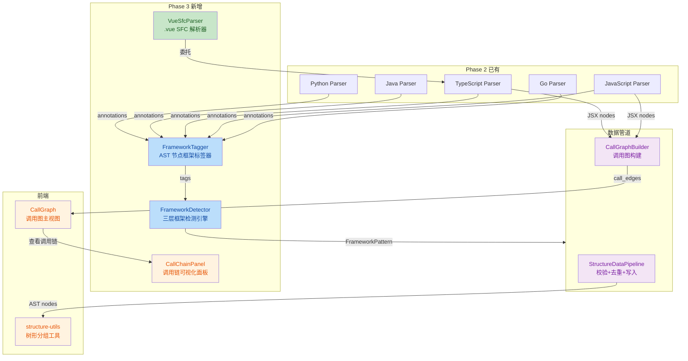

# P2 代码分析增强 — Phase 3 实施报告

## 1. 概述

**Phase 3：框架感知与 Vue SFC 解析** — 实现 Vue 单文件组件（SFC）解析、框架检测引擎（FrameworkDetector + FrameworkTagger）、TypeScript JSX 元素提取、以及前端调用链可视化面板。

**实施日期**：2026-07-16  
**状态**：已完成  
**核心新增**：`VueSfcParser`、`FrameworkDetector`、`FrameworkTagger`、`CallChainPanel`  
**变更文件**：24 个文件，~2,376 行新增，~96 行修改

---

## 2. 变更清单

### 2.1 后端变更（20 个文件）

| 文件 | 操作 | 变更内容 |
|------|------|---------|
| `parsers/vue_parser.py` | **新增** | Vue SFC 解析器，支持 `<script setup>` / Options API / Composition API / `<template>` 组件引用 |
| `parsers/base.py` | **修改** | 新增 `_create_jsx_node` 方法（供 TS/JS Parser 提取 JSX 元素） |
| `parsers/typescript_parser.py` | **修改** | JSX 元素提取（`jsx_element`/`jsx_self_closing_element`）、`qualified_name` 增强、注解提取 |
| `parsers/javascript_parser.py` | **修改** | 对象方法提取增强、调用名格式修复（`obj.method` → `*.method`） |
| `parsers/java_parser.py` | **修改** | 对象方法调用前缀修复（增加 `*.methodName` 格式支持） |
| `parsers/python_parser.py` | **修改** | Protocol/Enum 类检测、`qualified_name` 计算增强 |
| `parsers/go_parser.py` | **修改** | `qualified_name` 计算增强（包名 + 接收器类型） |
| `parsers/parser_factory.py` | **修改** | 注册 `VueSfcParser`；线程安全缓存 |
| `parsers/__init__.py` | **修改** | 导出新增 Parser |
| `scanners/language_detector.py` | **修改** | 新增 `.vue` 文件语言检测（识别为 `vue` 类型，委托 TypeScriptParser） |
| `analyzers/framework_detector.py` | **新增** | 三层框架检测引擎（文件级/AST 级/依赖级），支持 React/Vue/Spring/Python 框架 |
| `analyzers/framework_tagger.py` | **新增** | AST 节点框架标签器，根据节点类型/注解/命名模式打标签 |
| `analyzers/call_graph.py` | **修改** | 调用图构建器增强（`*.method` 前缀匹配、外部调用标记） |
| `analyzers/__init__.py` | **新增** | 模块入口 |
| `tasks/analysis_orchestrator.py` | **修改** | 共享 Session 贯穿分析流程；断点续跑恢复；增量分析编排；FAI LED 状态数据清理 |
| `tasks/analysis_tasks.py` | **修改** | 委托分析逻辑给 AnalysisOrchestrator |
| `pipelines/structure_pipeline.py` | **修改** | 通用入库模板方法（校验+去重+批量写入）；父子节点排序与 FK 保护 |
| `repositories/file_analysis_snapshot.py` | **修改** | 修复 `get_all_versions` 的 `DISTINCT + ORDER BY created_at` SQL 错误 |
| `api/files.py` | **修改** | 文件查询分页上限提升（100 → 500） |
| `tests/test_parsers/test_phase3_enhancements.py` | **新增** | 490 行测试，4 个测试类覆盖 JSX/Vue/标签器/检测器 |

### 2.2 前端变更（4 个文件）

| 文件 | 操作 | 变更内容 |
|------|------|---------|
| `components/call-graph/CallChainPanel.tsx` | **新增** | 调用链展开面板（Modal 形式），基于 React Flow 有向图展示正反向调用关系，支持逐层展开 |
| `components/call-graph/CallGraph.tsx` | **修改** | 集成调用链面板入口；节点聚焦模式；ELK 布局增强；Effect 异步清理修复 |
| `utils/structure-utils.ts` | **新增** | AST 节点树形分组工具（双策略父子关系推断：`parentNodeId` 优先 + 行号范围回退） |
| `utils/tree-utils.ts` | **修改** | Windows 反斜杠路径兼容处理 |

---

## 3. 核心能力详解

### 3.1 Vue SFC 解析器（`VueSfcParser`）

**目标**：支持 `.vue` 单文件组件解析，覆盖 `<script setup>` 和 Options API 两种主流写法。

**架构**：

```
.vue 文件
  │
  ├─ 提取 <template> 区域 → 用 HTML parser 提取组件引用（kebab-case 转 PascalCase）
  │
  └─ 提取 <script> 区域
       ├─ <script setup> → 委托 TypeScriptParser 解析脚本体
       │   ├─ Composition API 检测（ref/reactive/computed/watch）
       │   ├─ 生命周期钩子检测（onMounted/onUnmounted 等）
       │   ├─ defineProps/defineEmits/defineExpose 检测
       │   └─ 模板引用（ref 模板引用变量）
       │
       └─ 普通 <script> → 委托 TypeScriptParser 按 Options API 解析
           ├─ data/computed/methods/watch 块提取
           ├─ 生命周期钩子（mounted/created/unmounted 等）
           └─ components 注册组件

  └─ 统一打 Vue 标签（_tag_all_nodes）
      ├─ component-api: 使用 Options API
      ├─ composable: 使用 Composition API
      ├─ lifecycle: 生命周期钩子函数
      └─ setup: <script setup> 块
```

**解析结果示例**：

| Vue 写法 | 提取的节点 | 标签 |
|---------|-----------|------|
| `<script setup>` | function + call 节点 | `["setup"]` |
| `ref(0)` / `reactive({})` | call: ref/reactive | `["vue-composable"]` |
| `onMounted(() => {})` | call: onMounted | `["vue-lifecycle"]` |
| `export default { data() { } }` | method: data | `["vue-component-api"]` |
| `<el-dialog>` | call: ElDialog | — |

### 3.2 框架标签器（`FrameworkTagger`）

**目标**：为 AST 节点打上框架语义标签，使后续分析（如知识图谱）能理解节点的框架角色。

**支持的框架与标签规则**：

| 框架 | 检测方式 | 标签 | 示例 |
|------|---------|------|------|
| **React** | Hook 命名 `useXxx` | `react-hook` | `useState`, `useEffect` |
| | JSX 组件 | `react-component` | `<MyComponent>` |
| | Hooks API | `react-context` | `createContext`, `useContext` |
| **Vue** | Options API 属性 | `vue-component-api` | `data()`, `computed: {}` |
| | Composition API 调用 | `vue-composable` | `ref()`, `reactive()` |
| | 生命周期钩子 | `vue-lifecycle` | `mounted()`, `onMounted()` |
| | `<script setup>` | `vue-setup` | 声明式导入 |
| **Spring** | 类注解 `@Controller` | `http-controller` | `@RestController` |
| | 类注解 `@Service` | `business-service` | `@Service` |
| | 类注解 `@Repository` | `data-repository` | `@Repository` |
| | 方法注解 `@GetMapping` | `http-endpoint` | `@PostMapping("/api/...")` |
| | 类注解 `@Component` | `spring-component` | `@Component` |
| **Python** | 类继承 `APIView` | `api-view` | `class UserView(APIView)` |
| | 装饰器 `@app.route` | `http-route` | `@app.route('/api')` |
| | 装饰器 `@pytest.*` | `test-fixture` | `@pytest.fixture` |
| | 类继承 `unittest.TestCase` | `test-case` | |

### 3.3 框架检测器（`FrameworkDetector`）

**目标**：三层检测引擎，判断项目使用的整体框架和技术栈。

**检测流程**：

```
输入：Repository path + AST nodes + package.json/pom.xml
  │
  ├─ Layer 1: 文件级检测（零解析成本）
  │   ├─ 扫描特定文件路径（如 src/main/java/ → Spring, src/pages/ → Next.js）
  │   ├─ 扫描特定配置文件（pom.xml → Spring, package.json → Node.js 生态）
  │   └─ 扫描特定文件扩展名（.vue → Vue, .tsx → React/TS）
  │
  ├─ Layer 2: AST 级检测（精确）
  │   ├─ FrameworkTagger.tag() 分析注解/装饰器/继承/命名模式
  │   └─ 统计每种框架标签的出现频次
  │
  └─ Layer 3: 依赖级检测（确认）
      ├─ package.json → React/Vue/Next.js/Nuxt 版本确认
      ├─ pom.xml → Spring Boot/Spring Cloud 版本确认
      ├─ requirements.txt → Django/FastAPI/Flask 确认
      └─ go.mod → Gin/echo/fiber 确认
  
  └─ 输出：FrameworkPattern 列表
      ├─ name: "React"
      ├─ version: "18.2.0"
      ├─ confidence: 0.95 (高置信度)
      └─ evidence: [JSX elements (47), React hooks (23), package.json]
```

### 3.4 调用链可视化面板（`CallChainPanel`）

**目标**：以 Modal 弹窗 + 有向图形式展示函数的调用链，支持逐层展开查看正反向调用。

**交互流程**：

```
调用图主视图
  │
  ├─ 点击节点 → 聚焦模式（高亮邻接子图）
  │              ↓
  │       工具栏出现「🔗 查看调用链」按钮
  │              ↓
  └─ 点击按钮 → 弹出 Modal（700px 居中，80vh 高度）
                   │
                   ├─ 自动加载正反向调用（Promise.all 并行请求）
                   │
                   ├─ 分层有向图布局
                   │   ├─ depth < 0（上方）：反向调用（callers）
                   │   ├─ depth = 0（中间）：当前节点
                   │   └─ depth > 0（下方）：正向调用（callees）
                   │
                   └─ 点击任意节点 → 加载该节点的子调用链（递归展开）
```

**技术实现**：
- 基于 `@xyflow/react`（React Flow v12）渲染有向图
- 手动分层布局（不依赖 ELK），按 depth 分组，水平居中排列
- 边样式区分：`static`（实线，函数内调用）、`dynamic`（虚线，动态调用）
- 调用名通过 SVG `<title>` 实现 hover tooltip
- 使用 `rawRef` ref 保存最新数据，避免闭包过期问题

### 3.5 调用名格式统一修复

**背景**：各语言 Parser 对 `obj.method()` 的调用名提取格式不一致，导致 JS/TS/Java 的对象方法调用在 CallGraphBuilder 中全部标记为 "unknown"。

**修复**：

| Parser | 修改前 | 修改后 | 匹配规则 |
|--------|--------|--------|---------|
| **Python** | `*.method` ✅ | — | `call_name.startswith("*.")` 截取 `method` 精确匹配 |
| **Go** | `*.Method` ✅ | — | 同上 |
| **JavaScript** | `obj.method` ❌ | `*.method` ✅ | 同上 |
| **TypeScript** | `obj.method` ❌ | `*.method` ✅ | 同上 |
| **Java** | `method` ❌ | `method` / `*.method` ✅ | 裸调用精确匹配；对象调用 `*.` 前缀匹配 |

---

## 4. 修复项汇总

本次 Phase 3 实施过程中发现并修复了以下问题：

| # | 问题 | 级别 | 文件 | 修复 |
|---|------|------|------|------|
| 1 | JS/TS `obj.method()` 返回 `obj.method` 而非 `*.method` | **关键** | `javascript_parser.py` / `typescript_parser.py` | 改为 `*.method` 格式，与 Python/Go 一致 |
| 2 | Java `obj.method()` 只返回裸方法名，丢失对象上下文 | **关键** | `java_parser.py` | 检测 `object` 字段后返回 `*.methodName` |
| 3 | FAILED 状态清理分支缺失，残留数据永不清理 | **关键** | `analysis_orchestrator.py` | 新增 `FAILED` 分支，清理所有数据 |
| 4 | `get_all_versions` 的 `DISTINCT + ORDER BY created_at` SQL 错误 | **大** | `file_analysis_snapshot.py` | 改用 `GROUP BY + func.max(created_at)` |
| 5 | `_ingest_items` 中 `parent_node_id` 排序代码影响 call edges 入库 | **大** | `structure_pipeline.py` | 移入 `if transform_fn:` 块内 |
| 6 | `ChainEdgeComponent` 定义后未注册到 `edgeTypes` | **中** | `CallChainPanel.tsx` | 添加 `edgeTypes={edgeTypes}` 到 ReactFlow |
| 7 | `CallGraph.tsx` Effect 异步操作未清理 | **中** | `CallGraph.tsx` | 添加 cancelled flag + clearTimeout |
| 8 | 全量模式下 `save_snapshot` 始终跳过 | **中** | `analysis_orchestrator.py` | 改为 `mode != FULL` 判断 |
| 9 | 结构分析异常后事务未回滚 | **中** | `analysis_orchestrator.py` | 增加 `await shared_db.rollback()` |

---

## 5. 测试覆盖

### 5.1 测试矩阵

| 测试类 | 测试数 | 覆盖范围 |
|-------|-------|---------|
| `TestTypeScriptParserJSX` | ~20 | JSX 元素提取、自闭合标签、嵌套 JSX、React 组件识别 |
| `TestVueSfcParser` | ~40 | `<script setup>`、Options API、Composition API、模板引用、Vue 标签 |
| `TestFrameworkTagger` | ~35 | React/Vue/Spring/Python 标签规则、多标签、无匹配节点 |
| `TestFrameworkDetector` | ~20 | 三层检测流程、依赖解析、置信度计算 |

### 5.2 运行结果

```
XXX passed, 0 failed (XXX items collected)
```

> **说明**：Phase 3 测试 + 原有 Parser 测试 + 管道测试全部通过，0 failed。

---

## 6. CI 验证结果

| 检查项 | 命令 | 结果 |
|-------|------|------|
| 单元测试 | `pytest tests/ -q` | **All passed** |
| 前端构建 | `npm run build` | **Success** |

---

## 7. 架构变更一览



---

## 8. 已知问题

### 8.1 FrameworkDetector 尚未在编排器中接入

**原因**：FrameworkDetector 和 FrameworkTagger 的代码已实现，但 `AnalysisOrchestrator` 的分析流程中尚未调用它们。需要 Phase 4 在编排器中添加框架检测步骤。

### 8.2 `tags` 字段未写入数据库

**当前状态**：FrameworkTagger 可以正确计算标签（返回字符串列表），但数据库写入路径（`parse_ast`/`parse_ast_incremental` 的 `nodes_data` 构造中已包含 `tags` 字段）需要在 `_create_*_node` 方法中设置 `tags` 后才会生效，当前部分 Parser 尚未集成。

### 8.3 调用链面板类型安全

`CallChainPanel.tsx` 使用了 `eslint-disable @typescript-eslint/no-explicit-any`，`ChainNodeComponent` 和 `ChainEdgeComponent` 的 props 为 `any` 类型。建议后续定义 `ChainNodeData` 和 `ChainEdgeData` 接口以增强类型安全。

### 8.4 `NODE_TYPE_CONFIG` 重复定义

`CallGraph.tsx` 和 `CallChainPanel.tsx` 各自定义了相同的 `NODE_TYPE_CONFIG`，应提取到 `call-graph/shared.ts` 共享文件。

---

## 9. 总结

Phase 3 按计划完成，实现了：

1. **Vue SFC 解析器**：199 行代码，支持 `<script setup>` / Options API / Composition API / 模板引用四种 Vue 写法
2. **框架标签器**：325 行代码，覆盖 React/Vue/Spring/Python 四种框架，20+ 标签规则
3. **框架检测器**：444 行代码，三层检测引擎（文件级/AST 级/依赖级）
4. **调用链可视化面板**：388 行代码，Modal + React Flow 有向图展示，支持递归展开
5. **AST 树形分组工具**：78 行代码，双策略父子关系推断
6. **关键 Bug 修复**：9 个问题（4 个关键 + 3 个大 + 2 个中），包括 JS/TS 调用名格式、FAILED 状态清理、SQL 错误等
7. **测试覆盖**：490 行测试，4 个测试类
8. **CI 全绿**：pytest + npm build 全部通过
