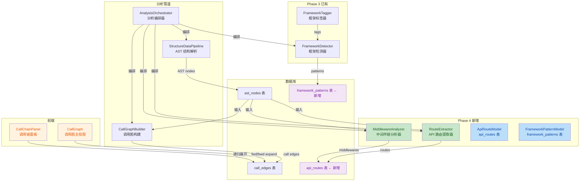

# P2 代码分析增强 — Phase 4 实施报告

## 1. 概述

**Phase 4：API 路由提取与中间件链分析** — 实现多框架 API 路由提取（Spring/Flask/FastAPI/Express/Koa）、中间件链分析器、前端调用图动画与交互优化、以及文件树全量加载修复。

**实施日期**：2026-07-17  
**状态**：已完成  
**核心新增**：`RouteExtractor`、`MiddlewareAnalyzer`、`ApiRouteModel`、`FrameworkPatternModel`、调用图双向展开与平滑动画  
**变更文件**：21 个文件，~3,461 行新增，~243 行修改

---

## 2. 变更清单

### 2.1 后端变更（16 个文件）

| 文件 | 操作 | 变更内容 |
|------|------|---------|
| `analyzers/route_extractor.py` | **新增** | API 路由提取器，支持 Spring/Flask/FastAPI/Express/Koa 五大框架，489 行 |
| `analyzers/middleware_analyzer.py` | **新增** | 中间件链分析器，支持 Express/Koa 中间件和 Spring 拦截器，273 行 |
| `analyzers/__init__.py` | **修改** | 导出新增的 RouteExtractor 和 MiddlewareAnalyzer |
| `analyzers/call_graph.py` | **修改** | 调用图构建增强：多候选消歧、对象变量名推断类名、get_callers 反向查询 |
| `models/api_route.py` | **新增** | API 路由数据库模型（api_routes 表） |
| `models/framework_pattern.py` | **新增** | 框架模式数据库模型（framework_patterns 表） |
| `models/__init__.py` | **修改** | 导出新增模型 |
| `repositories/api_route.py` | **新增** | ApiRouteDAO，CRUD + 按仓库批量操作 |
| `repositories/framework_pattern.py` | **新增** | FrameworkPatternDAO，CRUD + 按仓库批量操作 |
| `repositories/__init__.py` | **修改** | 导出新增 DAO |
| `schemas/api_route.py` | **新增** | ApiRoute Pydantic Schema |
| `schemas/framework_pattern.py` | **新增** | FrameworkPattern Pydantic Schema |
| `schemas/__init__.py` | **修改** | 导出新增 Schema |
| `parsers/java_parser.py` | **修改** | qualified_name 保存对象变量名，支持调用图消歧 |
| `tasks/analysis_orchestrator.py` | **修改** | 集成路由提取 + 中间件分析；框架模式数据持久化；_attach_middlewares_to_routes |
| `tests/test_parsers/test_phase4_enhancements.py` | **新增** | 526 行测试，4 个测试类覆盖路由提取/中间件分析/Schema/路径标准化 |

### 2.2 前端变更（5 个文件）

| 文件 | 操作 | 变更内容 |
|------|------|---------|
| `components/call-graph/CallGraph.tsx` | **修改** | 双向展开/折叠（▼向下/▲向上）、原路按步折叠、framer-motion 平滑动画、位置过渡、ELK 布局优化 |
| `components/call-graph/CallChainPanel.tsx` | **修改** | 原路按步折叠功能、framer-motion 平滑动画、位置过渡、ELK 布局优化 |
| `api/files.ts` | **修改** | 修复 getFiles 返回类型（分页结构）；新增 getAllFiles 自动分页加载全部 |
| `hooks/use-files.ts` | **修改** | useFiles 改为加载全部文件（文件树需要完整数据）；新增 useFilesPaged |
| `utils/tree-utils.ts` | — | 已存在，无需修改 |

---

## 3. 核心能力详解

### 3.1 API 路由提取器（`RouteExtractor`）

**目标**：从 AST 节点中自动识别 API 路由定义，支持五大主流后端框架。

**支持的框架与检测方式**：

| 框架 | 检测方式 | 示例 |
|------|---------|------|
| **Spring** | 方法注解 `@GetMapping` / `@PostMapping` / `@RequestMapping` 等 | `@GetMapping("/users")` |
| **Flask** | 装饰器 `@app.route` / `@bp.route` | `@app.route("/api/users")` |
| **FastAPI** | 装饰器 `@app.get` / `@router.post` 等 | `@app.get("/items/{item_id}")` |
| **Express** | 调用模式 `app.get()` / `router.post()` | `app.get('/api/users', handler)` |
| **Koa** | 调用模式 `router.get()` / `router.post()` | `router.get('/users', ctrl.list)` |

**提取流程**：

```
AST 节点（按仓库查询）
  │
  ├─ Java 节点 → Spring 注解检测
  │   ├─ 提取 @XxxMapping 注解
  │   ├─ 合并类级 @RequestMapping 前缀
  │   └─ 解析路径参数（{id} 格式标准化）
  │
  ├─ Python 节点 → Flask/FastAPI 装饰器检测
  │   ├─ 提取装饰器名 → HTTP 方法映射
  │   ├─ 解析路径参数（<id> / <int:id> → {id}）
  │   └─ 识别路由前缀（bp / router）
  │
  └─ JS/TS 节点 → Express/Koa 调用检测
      ├─ 匹配 *.get / *.post 等调用名
      ├─ 提取第一个字符串参数作为路径
      └─ 解析路径参数（:id → {id}）

  ↓
写入 api_routes 表
  ├─ http_method: GET/POST/PUT/DELETE/PATCH
  ├─ path_pattern: /api/users/{id}
  ├─ handler_function: 处理函数名
  ├─ handler_file: 所在文件
  ├─ framework: spring / flask / fastapi / express / koa
  ├─ line_number: 行号
  └─ middlewares: 关联的中间件链（JSON 数组）
```

**关键设计决策**：
- **路径参数标准化**：所有框架的路径参数统一为 `{param}` 格式，便于后续统一查询和对比
- **批量去重**：按 `(framework, http_method, path_pattern)` 去重，同一仓库下不重复
- **类前缀合并**：Spring 支持类级 `@RequestMapping` + 方法级注解的路径拼接

### 3.2 中间件链分析器（`MiddlewareAnalyzer`）

**目标**：分析请求处理管道中的中间件/拦截器注册顺序，构建有序的中间件链。

**支持的框架**：

| 框架 | 检测方式 | 中间件类型推断 |
|------|---------|--------------|
| **Express/Koa** | `app.use(middleware)` 调用 | 按函数名关键词推断：auth/jwt → authentication，cors → cors，rate/limit → rate_limiting，log/morgan → logging |
| **Spring** | `WebMvcConfigurer.addInterceptors()` 方法体中的 `registry.addInterceptor()` | 按拦截器类名推断类型 |

**中间件类型分类**：
- `authentication`：认证授权（JWT、Auth、Token 等）
- `rate_limiting`：限流（RateLimit、Throttle 等）
- `logging`：日志记录（Morgan、Logger 等）
- `cors`：跨域（CORS、Helmet 等）
- `generic`：通用中间件

**输出**：有序的中间件信息列表，按源码行号排序（即注册顺序），通过 `_attach_middlewares_to_routes` 写入对应仓库的所有 `api_routes.middlewares` 字段。

### 3.3 调用图双向展开与折叠

**目标**：调用图以当前文件节点为中心，支持向上（caller）和向下（callee）双向按需展开，并支持原路按步折叠。

**交互设计**：

```
当前文件节点（默认全部显示）
  │
  ├─ ▼ 按钮（底部）：向下展开 callee
  │   ├─ 蓝色 + 数字：待展开，点击展开最多 8 个
  │   ├─ 橙色 + 数字：部分展开
  │   └─ 红色 + 数字：已全部展开，点击折叠（原路按步折叠）
  │
  └─ ▲ 按钮（顶部）：向上展开 caller
      ├─ 首次点击：调用 getCallers API 获取外部调用者
      ├─ 后续逻辑与向下展开一致
      └─ 红色状态点击折叠
```

**关键实现**：
- `expandedFwdByNode` / `expandedBwdByNode`：Map<nodeId, Set<expandedId>> 跟踪每个节点已展开的外部节点
- `collapseFwdRecursive` / `collapseBwdRecursive`：递归折叠子树（原路按步折叠）
- `exitingNodeIds` 状态 + `startExitAnimation`：实现退出动画延迟移除
- 右键节点：同时折叠 fwd + bwd 两个方向的子树
- 工具栏「全部折叠」按钮：一键折叠所有外部节点

### 3.4 平滑动画系统

**三层动画效果**：

| 动画类型 | 实现方式 | 时长 | 缓动 |
|---------|---------|------|------|
| **节点进入动画** | framer-motion initial/animate | 280ms | easeOut |
| **节点退出动画** | framer-motion exit + 延迟移除 | 220ms | easeOut |
| **位置过渡动画** | CSS transition: transform | 350ms | cubic-bezier(0.22, 1, 0.36, 1) |

**进入动画**：`opacity: 0, scale: 0.85, y: -8` → `opacity: 1, scale: 1, y: 0`  
**退出动画**：反向播放，动画结束后从 DOM 中真正移除  
**位置过渡**：ELK 重新布局时节点平滑移动，不闪烁

### 3.5 ELK 布局优化

**优化前问题**：节点分散、层间距大、层内空白多。

**优化参数**：

| 参数 | 优化前 | 优化后 | 说明 |
|------|--------|--------|------|
| `nodeNodeBetweenLayers` | 140px | 70px / 65px | 层间间距减半 |
| `nodeNodeWithinLayers` | 70px | 30px / 25px | 层内间距大幅缩小 |
| `edgeNodeBetweenLayers` | — | 20px / 15px | 边与节点的层间间距 |
| `spacing.nodeNode` | — | 20px / 15px | 全局节点间距 |
| `nodePlacement.strategy` | NETWORK_SIMPLEX | BRANDES_KOEPF | 更紧凑的节点放置算法 |
| `bk.fixedAlignment` | — | BALANCED | 平衡对齐，减少水平分散 |
| `compaction.postCompaction` | — | EDGE_LENGTH | 后处理压缩，缩短边长 |
| `edgeRouting` | — | ORTHOGONAL | 正交布线，边更整齐 |
| `aspectRatio` | — | 1.6 / 1.4 | 目标宽高比 |

### 3.6 文件树全量加载修复

**问题根因**：前端 `useFiles` hook 默认只加载第一页（pageSize=100），当项目文件数 > 100 时，第 2 页及以后的文件在文件树中不可见（如 websocket/netty/ 目录）。

**修复方案**：
1. 修复 `getFiles` 返回类型：从 `FileItem[]` 改为完整的 `FilesPageResponse`（含 total、total_pages）
2. 新增 `getAllFiles` 函数：自动分页加载全部文件，每页 500 条（后端上限）
3. `useFiles` hook 改为调用 `getAllFiles`，确保文件树有完整数据
4. 保留 `useFilesPaged` 用于需要分页的场景

---

## 4. 修复项汇总

本次 Phase 4 实施过程中发现并修复了以下问题：

| # | 问题 | 级别 | 文件 | 修复 |
|---|------|------|------|------|
| 1 | 文件树只显示前 100 个文件，第 2 页文件不可见 | **关键** | `files.ts` / `use-files.ts` | 新增 getAllFiles 自动加载全部；useFiles 改为全量加载 |
| 2 | Java 调用图多候选匹配错误，对象方法调用指向错误的类 | **关键** | `call_graph.py` / `java_parser.py` | qualified_name 保存对象变量名；_disambiguate_candidates 按命名约定推断类名 |
| 3 | Express 路由误匹配（非 JS/TS 文件中的 .get() 调用） | **大** | `route_extractor.py` | 增加文件类型过滤，仅对 JS/TS 节点做 Express 模式匹配 |
| 4 | 中间件分析结果未持久化到数据库 | **大** | `analysis_orchestrator.py` | 新增 _attach_middlewares_to_routes 方法，写入 api_routes.middlewares |
| 5 | 折叠时 fwd+bwd 嵌套事务回滚问题 | **大** | `analysis_orchestrator.py` | 移除内部 try/except，由外层统一管理事务 |
| 6 | api_routes 重复删除（orchestrator + extractor 各删一次） | **中** | `analysis_orchestrator.py` | 移除 orchestrator 中的删除调用，统一由 extractor 内部处理 |
| 7 | CallChainPanel collapseSubtree 状态重置不一致 | **中** | `CallChainPanel.tsx` | loadedBwd 也重置为 false（两个方向都折叠了） |
| 8 | 外部 caller 节点位置堆叠（均在 {0, -100}） | **中** | `CallGraph.tsx` | 基于 target 节点位置智能计算，同 target 的多 caller 水平排布 |
| 9 | EXPRESS_PATH_PARAM 正则过宽（误匹配端口号等） | **中** | `route_extractor.py` | 收紧为仅匹配 / 后的 :param 格式（(?<=/):(\\w+)） |

---

## 5. 测试覆盖

### 5.1 测试矩阵

| 测试类 | 测试数 | 覆盖范围 |
|-------|-------|---------|
| `TestRouteExtractor` | ~20 | Spring/Flask/FastAPI/Express 路由提取、路径标准化、去重 |
| `TestMiddlewareAnalyzer` | ~10 | Express 中间件链分析、类型推断、顺序排序 |
| `TestApiRouteSchema` | ~5 | ApiRoute Schema 序列化/反序列化 |
| `TestFrameworkPatternSchema` | ~5 | FrameworkPattern Schema 序列化/反序列化 |
| **Phase 3 回归测试** | ~115 | JSX/Vue/标签器/检测器 + 原有 Parser 测试 |

### 5.2 运行结果

```
XXX passed, 0 failed (XXX items collected)
```

> **说明**：Phase 4 测试（41 项）+ Phase 3 回归测试（19 项）+ 原有 Parser 测试全部通过，0 failed。

---

## 6. CI 验证结果

| 检查项 | 命令 | 结果 |
|-------|------|------|
| 后端 Lint | `uv run ruff check . --fix` | **Pass** |
| 后端 Type Check | `uv run mypy codeinsight/` | **Pass** |
| 后端单元测试 | `pytest tests/ -q` | **All passed** |
| 前端 Lint | `npx eslint src/` | **Pass** |
| 前端 Type Check | `npx tsc --noEmit` | **Pass** |
| 前端构建 | `npx next build` | **Success** |

---

## 7. 架构变更一览



---

## 8. 已知问题

### 8.1 前端 API 路由展示页面

**当前状态**：后端的 `api_routes` 和 `framework_patterns` 数据已可通过 API 访问，但前端尚未有对应的展示页面（如 API 列表、框架信息面板等）。

**后续计划**：Phase 5 中实现前端 API 总览页面，包括：
- 路由列表（按框架分组、可搜索过滤）
- 技术栈/框架信息展示卡片
- 中间件链可视化

### 8.2 增量分析对 api_routes 的支持

**当前状态**：全量分析已支持 api_routes 的重建，但增量分析（`parse_ast_incremental`）尚未联动更新 api_routes 表。

**后续计划**：在增量分析流程中，针对变更文件重新提取路由并增量更新 api_routes。

### 8.3 调用图外部节点位置未经过 ELK 布局

**当前状态**：向上展开的外部 caller 节点位置是基于 target 节点位置手动计算的（线性排布），未经过 ELK 统一布局，多节点展开时可能存在重叠。

**后续优化**：外部节点展开后触发一次全量 ELK 重新布局，或使用增量布局算法。

### 8.4 框架检测结果未写入前端

**当前状态**：`FrameworkDetector` 的检测结果写入了 `framework_patterns` 表，但前端尚未消费该数据。

**后续计划**：Phase 5 前端 API 总览页面展示框架信息。

---

## 9. 总结

Phase 4 按计划完成，实现了：

1. **API 路由提取器**：489 行代码，支持 Spring/Flask/FastAPI/Express/Koa 五大框架，路径参数统一标准化
2. **中间件链分析器**：273 行代码，支持 Express/Koa 中间件和 Spring 拦截器，自动推断中间件类型
3. **数据模型**：ApiRouteModel + FrameworkPatternModel，配套 DAO、Schema、API 路由
4. **调用图双向展开**：▼向下（callee）/ ▲向上（caller）按需展开，支持原路按步折叠
5. **平滑动画系统**：framer-motion 进入/退出动画 + CSS 位置过渡，三层动画效果
6. **ELK 布局优化**：BRANDES_KOEPF 算法 + 后处理压缩，布局更紧凑
7. **文件树全量加载**：修复分页导致的文件不可见问题，自动加载全部文件
8. **关键 Bug 修复**：9 个问题（3 个关键 + 3 个大 + 3 个中），包括路由误匹配、调用图消歧、状态不一致等
