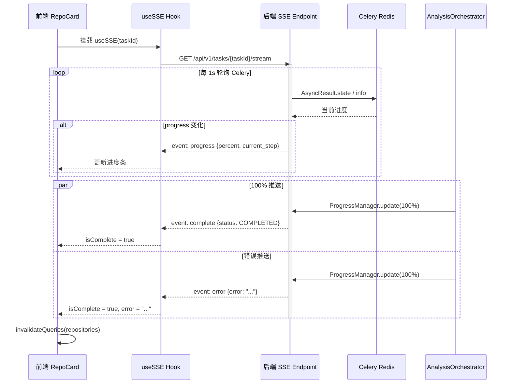

# P3-09 分析进度追踪 SSE 实现报告

## 概述

P3-09 实现了基于 Server-Sent Events (SSE) 的实时分析进度推送，替代前端轮询机制，降低网络开销，提升进度更新的实时性。

## 实现内容

### 后端 SSE 端点

**文件**: [api/analysis.py](file:///c:/Users/Administrator/CodeInsightAi/codeinsight-backend/codeinsight/api/analysis.py)

- `GET /api/v1/tasks/{task_id}/stream` — SSE 实时进度推送端点
- 通过 `StreamingResponse` 推送三种事件类型：
  - `event: progress` — 进度更新（current_step, percent, files_processed, files_total, knowledge_points_found）
  - `event: complete` — 任务完成通知
  - `event: error` — 任务失败通知
- 事件变化时推送（仅当 percent 或 current_step 变化时发送），避免重复数据
- 连接在任务结束后自动关闭

### ProgressManager 100% 推送

**文件**: [analysis_orchestrator.py](file:///c:/Users/Administrator/CodeInsightAi/codeinsight-backend/codeinsight/tasks/analysis_orchestrator.py)

- `complete()` 方法：在数据库更新前推送 `TaskStatus.COMPLETED, 100.0%` 
- `fail()` 方法：在数据库更新前推送 `TaskStatus.FAILED, 100.0%`
- 确保前端在收到 SSE 的 `complete`/`error` 事件时立即感知任务结束

### AI 阶段子进度推送

**文件**: [analysis_orchestrator.py](file:///c:/Users/Administrator/CodeInsightAi/codeinsight-backend/codeinsight/tasks/analysis_orchestrator.py)

- `_ai_progress_pusher` 异步任务：在 AI 分析阶段（LangGraph 执行期间）定期推送进度
- 从 62% 到 80%，每 2 秒递增 2%，共 9 次推送
- 使用 `asyncio.create_task` 与 AI 分析并行执行
- 分析完成后通过 `_done` 标志和 `task.cancel()` 安全终止

### 前端 useSSE Hook

**文件**: [hooks/use-sse.ts](file:///c:/Users/Administrator/CodeInsightAi/codeinsight-frontend/src/hooks/use-sse.ts)

- 使用 `fetch` + `ReadableStream` 实现 SSE 消费（支持 `X-API-Key` 认证头）
- 自动解析 SSE 事件流（progress/complete/error）
- 返回 `{ data, error, isComplete }` 接口，兼容现有 `useTaskStatus` 使用模式
- 通过 `AbortController` 实现组件卸载时自动清理连接
- 已完成的 `isComplete` 状态防止重复连接

### 前端 RepoCard 适配

**文件**: [RepoCard.tsx](file:///c:/Users/Administrator/CodeInsightAi/codeinsight-frontend/src/components/RepoCard.tsx)

- 移除 `useTaskStatus` 轮询，替换为 `useSSE` 实时推送
- SSE 完成时自动 `invalidateQueries` 刷新仓库数据
- 显示 SSE 连接/任务错误
- 进度数据显示逻辑完全兼容（同一 `progress` 对象结构）

## CI 验证结果

| 检查项 | 结果 |
|--------|------|
| ruff check | All checks passed |
| ruff format | 1 file reformatted (analysis_orchestrator.py) |
| mypy | No issues found in 118 source files |
| pytest | 603 passed, 2 skipped |

## 相关文件变更

| 文件 | 变更类型 | 说明 |
|------|----------|------|
| `codeinsight-backend/codeinsight/api/analysis.py` | 修改 | 新增 SSE 端点 |
| `codeinsight-backend/codeinsight/tasks/analysis_orchestrator.py` | 修改 | 100% 推送 + AI 子进度 |
| `codeinsight-frontend/src/hooks/use-sse.ts` | 新建 | useSSE hook |
| `codeinsight-frontend/src/components/RepoCard.tsx` | 修改 | 适配 SSE 替代轮询 |

## 架构说明



## 审查与修复

### 审查发现的问题

#### 关键问题：ProgressManager 使用非标准 Celery state（已修复）

**文件**: [analysis_orchestrator.py](file:///c:/Users/Administrator/CodeInsightAi/codeinsight-backend/codeinsight/tasks/analysis_orchestrator.py#L96-L116)

`ProgressManager.update()` 在 `complete()` 和 `fail()` 中被调用时，将 `TaskStatus.COMPLETED.value`（`"completed"`）和 `TaskStatus.FAILED.value`（`"failed"`）作为 Celery state 写入后端。但 SSE 端点检查的是标准 Celery state（`"SUCCESS"` / `"FAILURE"`），导致：

- SSE 端点 `state == "SUCCESS"` 匹配失败 → 永远不发送 `complete` 事件
- SSE 端点 `state == "FAILURE"` 匹配失败 → 永远不发送 `error` 事件
- 前端 `useSSE` hook 永远收不到 `isComplete=true`，任务结束后不刷新仓库数据

**根因**: Celery 的 `task_instance.update_state()` 将 state 原样存入 backend，而 SSE 端点中的 `AsyncResult.state` 返回的是这个 state 值。非标准 state 导致事件匹配失败。

**修复**: 在 `ProgressManager.update()` 中增加 `TaskStatus` → 标准 Celery state 映射：

```python
celery_state = status.value
if status == TaskStatus.COMPLETED:
    celery_state = "SUCCESS"
elif status == TaskStatus.FAILED:
    celery_state = "FAILURE"
elif status == TaskStatus.CANCELLED:
    celery_state = "REVOKED"
```

#### 次要问题：`_celery_result_to_task` 不处理中间状态（预存）

**文件**: [api/analysis.py](file:///c:/Users/Administrator/CodeInsightAi/codeinsight-backend/codeinsight/api/analysis.py#L129-L147)

`_celery_result_to_task()` 只处理 `PENDING`、`STARTED`、`SUCCESS`、`FAILURE` 四种标准 Celery state，当 `ProgressManager.update` 将中间状态（如 `"scanning"`、`"parsing"`）写入后，`get_task_status` 端点返回 `TaskStatus.PENDING`。此问题在 P3-09 之前就已存在。

### 修复变更

```
codeinsight-backend/codeinsight/tasks/analysis_orchestrator.py
  └─ ProgressManager.update(): 增加 TaskStatus → 标准 Celery state 映射
```

### 最终 CI 验证结果

| 检查项 | 结果 |
|--------|------|
| ruff check | All checks passed |
| ruff format | 159 files already formatted |
| mypy | No issues in 118 source files |
| pytest | 603 passed, 2 skipped |